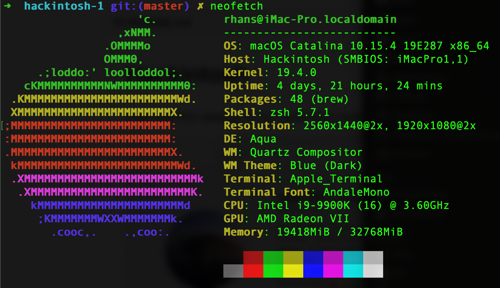

# Hackintosh
Files and info relating to my hackintosh build

Originally forked from https://github.com/NiknakSi/hackintosh

# Configuration:

* CPU: Intel Core i9-9900K 3.6 GHz 8-Core Processor

* CPU Cooler: Noctua NH-D15 chromax.Black, 140mm Dual-Tower dual 140mm fan CPU Cooler (Black)


* Motherboard: GIGABYTE Z390 DESIGNARE Gigabyte (Intel LGA1151/Z390/ATX/2xM.2/Thunderbolt 3/Onboard AC Wifi/12+1 Phases Digital Vrm/Motherboard)

* Memory: Corsair LPX 32GB (2x16GB) 3200MHz C16 DDR4 DRAM Memory Kit, Black (CMK32GX4M2B3200C16). 2 empty slots

* Primary Storage: Sabrent 1TB Rocket NVMe PCIe M.2 2280 Internal SSD High Performance Solid State Drive (SB-ROCKET-1TB)

* Windows Storage: Sabrent 256GB Rocket NVMe PCIe M.2 2280 Internal SSD High Performance Solid State Drive (SB-ROCKET-256)


* Video Card: Radeon VII 16GB HBM2, 1750 MHz Boost, 1801 MHz Peak, 3xDP 1xHDMI Pci-E 3.0


* Case: NZXT H510 Elite - CA-H510E-W1 - Premium Mid-Tower ATX Case PC Gaming Case - Dual-Tempered Glass Panel - Front I/O USB Type-C Port - Vertical GPU Mount - Integrated RGB Lighting - White/Black

* Power Supply: Corsair RM750x white

* Wireless and Bluetooth Adapter: Fenvi FV-T919 PCIe x1 802.11a/b/g/n/ac Wi-Fi Adapter


* Case Fans: 3x NZXT AER RGB 2 - HF-28140-B1 - 140mm LED fans, 1x NZXT AER RGB 2 - HF-28120-B1 - 120mm LED fan
